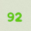
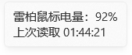
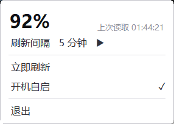

# RapooBattery

在 Windows 系统托盘显示雷柏（Rapoo）无线鼠标的电量百分比。

原生 Win32 / C++17，无 .NET 依赖，单文件 exe（260 KB），常驻内存约 2 MB。


## 为什么做这个

雷柏官方驱动只提供网页版，要开浏览器、点进设备页面才能看到电量。  
Windows 自带的电池面板不显示通过 2.4G 接收器连接的鼠标。

这个工具把电量直接放到托盘图标上，一眼可见。

## 效果



*托盘图标就是电量数字，颜色随电量变化。*

鼠标悬停显示文字详情：



左右键点击图标都会弹出浮窗：



`刷新间隔` 悬停或点击会向右展开子菜单（5 秒 / 10 秒 / 30 秒 / 1 分钟 / 5 分钟）。  
点击浮窗外部、按 `Esc`、或再点一次托盘图标都能关闭。

## 安装

### 直接使用

到 [**Releases**](https://github.com/JKL-04/RapoBattery/releases) 页面下载最新的 `RapooBattery.exe`，双击运行。

程序需要管理员权限，UAC 提示里点「是」即可。

### 从源码构建

需要 Visual Studio（含 C++ 生成工具）和 Windows SDK。

```bat
build.bat
```

脚本会自动定位 `vcvars64.bat`。也可以手工编译：

```bat
cd src
rc /nologo RapooBattery.rc
cl /nologo /W3 /O2 /EHsc /std:c++17 /utf-8 RapooBattery.cpp RapooBattery.res ^
   /Fe:RapooBattery.exe ^
   /link setupapi.lib hid.lib user32.lib gdi32.lib shell32.lib advapi32.lib
```

> 必须先用 `rc` 编译资源文件。它的作用是把 `RapooBattery.manifest`  
> 嵌进 exe —— 没有它程序会因权限不足而无法注册托盘图标。

## 使用

双击 `RapooBattery.exe`，托盘出现电量图标即完成。程序会记住你的刷新间隔设置。

开机自启在浮窗里勾选 `开机自启`，会创建一个任务计划程序项  
（以最高权限运行，登录时启动）。


## 项目结构

```
.
├── build.bat                 
├── src/
│   ├── RapooBattery.cpp      
│   ├── RapooBattery.manifest 
│   ├── RapooBattery.rc       
│   ├── app.ico               
│   └── glyphs_gen.h          
├── tools/
│   ├── svg2cpp.py            
│   ├── svg2ico.py            
│   ├── render_icons.py       
│   └── bmp2png.py            
├── assets/
│   ├── svg/                  
│   └── *.png                 
├── docs/
│   ├── TECHNICAL.md          
│   ├── PROTOCOL.md           
│   └── DEVELOPMENT.md        
```

## 许可

**GNU General Public License v3.0**（或更新版本）。见 [LICENSE](LICENSE)。

Copyright (C) 2026 JKL-04

这意味着你可以自由使用、修改和分发本程序，**但衍生作品必须同样以 GPL-3.0 开源**。
  
详见 [GNU 官方说明](https://www.gnu.org/licenses/gpl-3.0.html)。

## 致谢

托盘数字与图标使用的图标包由 [Nieobie](https://wakudemo.cn/assets/24) 提供，以 CC0 1.0 许可发布。
